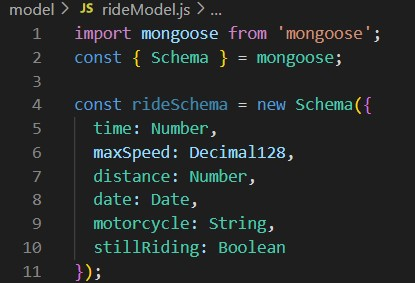

# Webová aplikace pro vizualizaci jízd na motocyklu
---
### Kdo to je
Jedná se o profesora Technické univerzity v Liberci.
### Kde pracuje
Pracuje převážně na budově H liberecké Technické univerzity.
### Co potřebuje
Poptává webovou aplikaci zobrazující data získaná během jízdy na motocyklu.
1. Vytvoření kostry webové stránky  
Celý projekt začínáme tím, že navrhneme základní vzhled celé stránky. V našem případě bude vzhled velice jednoduchý a stručný. Hlavním elementem stránky bude tabulka s vykreslenými daty. Tento element umístíme doprostřed, tak aby vše uživatel okamžitě viděl. Nad tabulku umístíme informace o jízdě ze které jsou data získána, tedy datum a motocykl ze kterého je jízda zaznamenána. Projekt navrhujeme v Expresu, tudíž vše stylizujeme pomocí html a css.
2. Backend
    1. Připojení k databázi  
    Data jsou uložena v databázi MongoDB, ke které se budeme připojovat pomocí knihovny Mongoose. Získáme connection string z klienta MongoDB. Pomocí něj se následně připojíme pomocí příkazu **mongoose.connect("***conection string**"*)**
    2. Získání dat  
    Pro získání dat je nejdříve potřeba vytvořit si schéma dané tabulky, kterou chci z databáze získat. Jelikož data z databáze pouze čteme, nemusíme definovat povinnost daných parametrů, tedy zdali by bylo možné vytvořit danou tabulku bez některých atributů.
    
    3. Práce s daty
        1. Vytřízení relevantních dat
        2. Datové operace
        3. Zpřehlednění dat pro jejich vykreslení
3. Frontend
    1. Stylizace webové stránky
    2. Získání dat z backendu
    3. Vykreslení dat na webové stránce
4. Hostování webové aplikace
    1. Hledání vhodného hostingu
    2. Zprovoznění aplikace online
