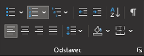
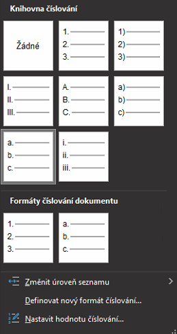

# Nastavení odrážek v Microsoft Word
V nejnovějších verzích Microsoft Wordu je přidávání číslovaných záložek velice intuitivní.
1. Otevřete již existující dokument
2. Nalezněte záložku domů, sekci odstavec.
3. Zvolte možnost číslování
4. 
5. Rozklikněte podvolbu číslování a zvolte styl který požadujete
6. 
